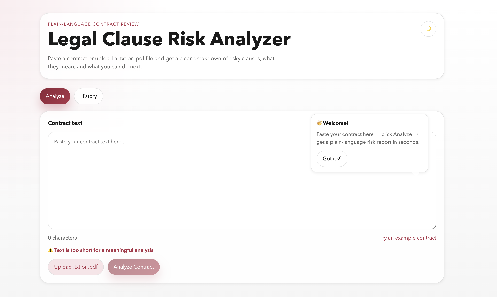
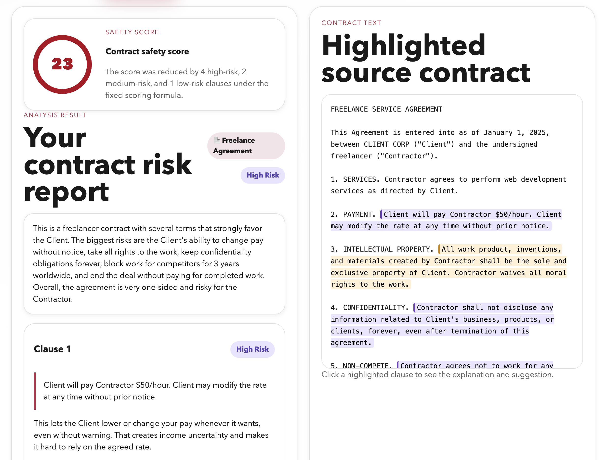
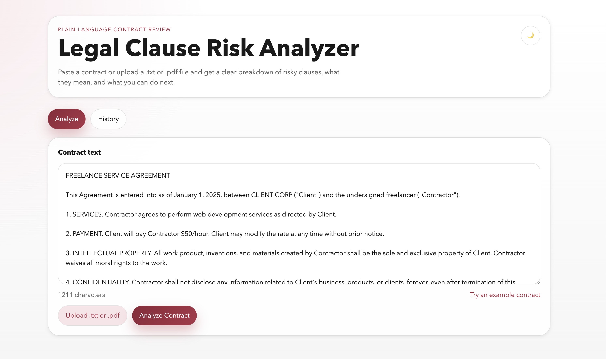
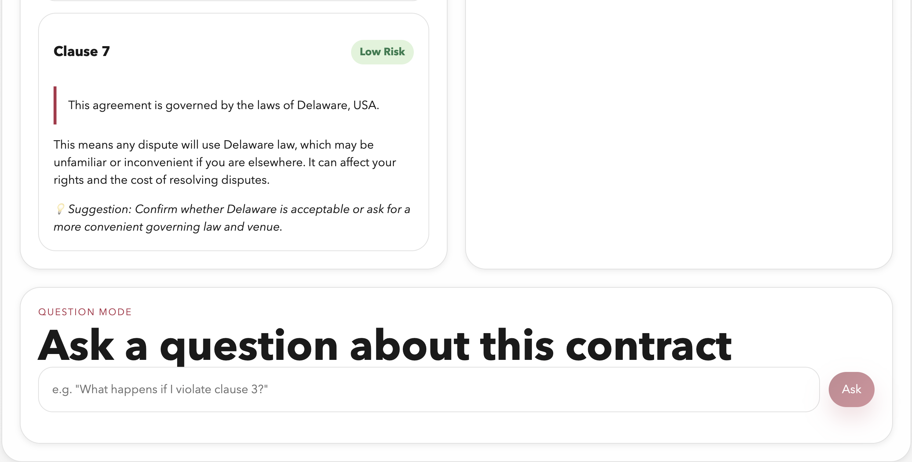

# Legal Clause Risk Analyzer

> AI assistant that analyzes contracts and highlights legal risks in simple language.


---

## Table of contents

- [Demo](#demo)
- [Product context](#product-context)
- [Features](#features)
- [How it works](#how-it-works)
- [Tech stack](#tech-stack)
- [API reference](#api-reference)
- [Environment variables](#environment-variables)
- [Deployment](#deployment)
- [Local development](#local-development-without-docker)
- [Project structure](#project-structure)
- [Current limitations](#current-limitations)

---

## Demo

| Contract input | Risk analysis results |
|---|---|
|  |  |

| Example contract loaded | Clause details and Q&A |
|---|---|
|  |  |

---

## Product context

| | |
|---|---|
| **End users** | Freelancers, students, and everyday people without legal background |
| **Problem** | People sign contracts without understanding the risks hidden in legal language |
| **Solution** | LLM-powered analysis that returns a plain-language breakdown of risky clauses, a safety score, contract type detection, and follow-up Q&A |

Typical use cases:

- reviewing freelance agreements before accepting work
- scanning NDAs for overbroad confidentiality or non-compete terms
- checking rental or service agreements for unfair liability and termination clauses
- preparing a plain-language summary to discuss with a lawyer or colleague

---

## Features

### Implemented

- [x] Paste contract text or upload `.txt` / `.pdf` files
- [x] Extract readable text from PDF documents
- [x] LLM-powered contract risk analysis via OpenRouter
- [x] Safety score (0–100) with plain-language explanation
- [x] Contract type detection (NDA, Freelance Agreement, Employment Contract, etc.)
- [x] Overall risk level and contract summary
- [x] Per-clause explanations and actionable suggestions
- [x] Highlighted contract text — risky excerpts marked by severity
- [x] Clicking a clause card syncs with the highlighted source text, and vice versa
- [x] Follow-up Q&A — ask questions about a previously analyzed contract
- [x] Full analysis and chat history persisted in PostgreSQL
- [x] History tab — reopen or delete previous analyses
- [x] Copy full report to clipboard
- [x] Dark mode toggle
- [x] Animated multi-step progress bar during analysis
- [x] Character counter with validation warnings
- [x] "Try an example contract" autofill button
- [x] First-use onboarding tooltip
- [x] Auto-scroll to results after analysis
- [x] Async OpenRouter requests (`httpx`) — no event loop blocking
- [x] Deterministic server-side safety score for reproducible results
- [x] Backend validation for short and oversized contract text
- [x] Docker Compose healthcheck and restart policy for reliable startup
- [x] Responsive two-column layout (stacks on mobile)

### Not yet implemented

- [ ] OCR for scanned PDFs without embedded text
- [ ] User authentication and multi-user history separation
- [ ] Export report as PDF
- [ ] Clause comparison across multiple contracts
- [ ] Legal jurisdiction-specific advice

---

## How it works

### 1 — Input
The user pastes contract text, uploads a `.txt` or `.pdf` file, or loads the built-in example contract. The interface validates the input length and shows a live character count before analysis starts.

### 2 — Analysis
The backend sends the contract text to OpenRouter with a structured prompt. The LLM returns a JSON object containing the risk level, contract type, summary, and a list of risky clauses. The server then calculates a deterministic safety score based on the number and severity of detected clauses — this makes the score stable and reproducible across repeated runs.

### 3 — Report
The page scrolls to the results area, which shows:

- a safety score ring (green / orange / red by range)
- the detected contract type
- the overall risk level
- a plain-language summary
- a card for each risky clause with explanation and suggestion

The original contract text is shown alongside the report with color-coded highlights for each risky excerpt. Clicking a clause card jumps to the matching highlight; clicking a highlight opens an explanation popup.

### 4 — Follow-up Q&A
Each saved analysis supports follow-up questions. The answer is generated using both the original contract and the prior analysis result. All Q&A pairs are saved to the database and reloaded when the analysis is reopened from History.

---

## Tech stack

| Layer | Technology |
|---|---|
| Frontend | React 18, Vite, plain CSS |
| Backend | FastAPI, SQLAlchemy |
| Database | PostgreSQL 16 |
| LLM provider | OpenRouter |
| Default model | `openai/gpt-4o-mini` |
| PDF parsing | `pypdf` |
| Async HTTP | `httpx` |
| Containers | Docker, Docker Compose |

---

## API reference

| Method | Endpoint | Description |
|---|---|---|
| `POST` | `/api/analyze` | Analyze pasted or uploaded contract text |
| `GET` | `/api/analyses` | List all saved analyses |
| `GET` | `/api/analyses/{id}` | Get a full saved analysis with clauses |
| `DELETE` | `/api/analyses/{id}` | Delete an analysis and its clauses |
| `POST` | `/api/analyses/{id}/ask` | Ask a follow-up question about a saved contract |
| `GET` | `/api/analyses/{id}/messages` | Fetch persisted chat history for an analysis |

Interactive API docs are available at `http://localhost:8000/docs` when the backend is running.

---

## Environment variables

Copy `.env.example` to `.env` and fill in your values:

```env
OPENROUTER_API_KEY=your_openrouter_api_key_here
OPENROUTER_MODEL=openai/gpt-4o-mini
```

| Variable | Required | Description |
|---|---|---|
| `OPENROUTER_API_KEY` | ✅ Yes | Your API key from [openrouter.ai](https://openrouter.ai) |
| `OPENROUTER_MODEL` | Optional | Model to use (default: `openai/gpt-4o-mini`) |

---

## Deployment

**Requirements:** Ubuntu 24.04, Docker, Docker Compose, Git.

```bash
# 1. Clone the repository
git clone https://github.com/llliizzz/se-toolkit-hackathon.git
cd se-toolkit-hackathon

# 2. Create and fill in the environment file
cp .env.example .env
nano .env   # set OPENROUTER_API_KEY

# 3. Build and start all services
docker compose up --build

# 4. Open the app
# Frontend:    http://localhost:5173
# Backend API: http://localhost:8000
# API docs:    http://localhost:8000/docs
```

> For external VM deployments, the frontend uses dynamic API host detection, so browser requests reach the backend even when the page is opened via a non-local IP address.

---

## Local development (without Docker)

### Backend

Requires Python 3.11+ and a locally running PostgreSQL instance.

```bash
cd backend
pip install -r requirements.txt
cp ../.env.example ../.env   # fill in your values
uvicorn main:app --reload --port 8000
```

### Frontend

Requires Node.js 20+.

```bash
cd frontend
npm install
VITE_API_URL=http://localhost:8000 npm run dev
```

Open `http://localhost:5173` in your browser.

---

## Project structure

```text
se-toolkit-hackathon/
├── docker-compose.yml
├── .env.example
├── .gitignore
├── LICENSE
├── README.md
├── backend/
│   ├── Dockerfile
│   ├── requirements.txt
│   ├── main.py              # FastAPI app entry point
│   ├── database.py          # SQLAlchemy engine and session
│   ├── models.py            # ORM models: Analysis, RiskClause, ChatMessage
│   ├── schemas.py           # Pydantic request/response schemas
│   └── routers/
│       └── analysis.py      # All API route handlers and LLM logic
├── docs/
│   └── screenshots/
│       ├── input-screen.png
│       ├── input-with-contract.png
│       ├── risk-report.png
│       └── clause-and-chat.png
└── frontend/
    ├── Dockerfile
    ├── package.json
    ├── vite.config.js
    ├── index.html
    └── src/
        ├── main.jsx
        ├── App.jsx              # Root component, routing, shared state
        ├── styles.css           # All CSS with custom properties for theming
        └── components/
            ├── ContractInput.jsx    # Text input, file upload, progress bar
            ├── RiskReport.jsx       # Score, clauses, copy button
            ├── ContractHighlight.jsx # Highlighted source text panel
            ├── HistoryList.jsx      # Saved analyses list
            └── QuestionChat.jsx     # Follow-up Q&A interface
```

---

## Current limitations

- PDF support works only for text-based PDFs; scanned image PDFs require OCR (not yet implemented)
- No user authentication — analysis history is shared across all users of the same deployment
- No export to PDF or clause comparison across multiple contracts
- The app explains legal risk in plain language but does not provide binding legal advice

---

## License

[MIT](LICENSE) — e.sotnikova@innopolis.university
